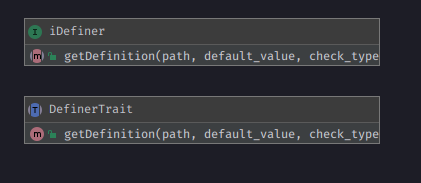
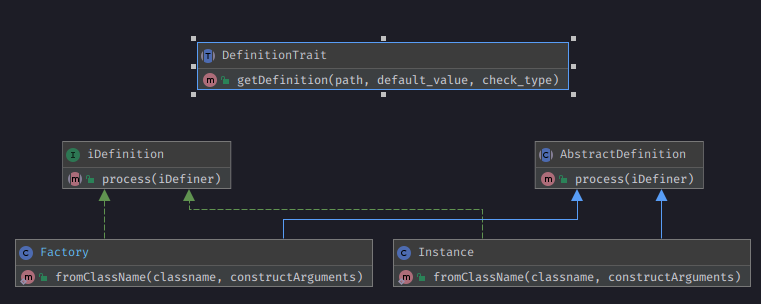

=====================
Definer/Definition Trait
=====================

.. php:trait:: DefinerTrait
.. php:trait:: DefinitionTrait

Agile Core extend support of ConfigTrait Dependency Injection using Definition of object directly in configuration.

Introduction
============

It works the same way as ConfigTrait, it only adds one method :

.. php:method: getDefinition(string $path, $default_value = null, bool $check_type = false)

This trait can help you with this features :

 - Get rid of all the *new* keyword in your code
 - Use one line to get any object defined, using method getDefinition
 - Define it using Definition\Factory, if you want a new object at every call
 - Define if using Definition\Instance, you want the same object like a singleton (isolated in $config of the object that implements iDefiner)
 - with flag $check_type=true allow a check for consistency that the return Type == $path

We suggest to use it against Interface FQCN, because in this way
you can declare it onetime and when you want to switch from one
implementation to another you have to change it only in one place,
the config file.

ATTENTION : We need to execute PHP code in configuration file,
due to that you can't use JSON and YAML format for configuration file.

Methods
=======

.. php:method:: getDefinition(string $path, $default_value = null, bool $check_type = false)

    Get processed element from iDefinition ( Instance or Factory ).

Diagram DefinerTrait & DefinitionTrait
======================================

DefinerTrait::
DefinerTrait
------------

the object that use this trait must use interface Definition\iDefiner
this is the object that provide the definitions.
In atk4 is App, out of atk4 must be a sort of master container with AppScopeTrait + ContainerTrait

Note : internally DefinerTrait already use ConfigTrait.

DefinitionTrait::
DefinitionTrait
---------------

Can be used by any object that also use AppScope and is added to another object
that use ContainerTrait which implements iDefiner, like a $this->app->add(ObjectWithDefinitionTrait),
this way it gets the reference to ->app and consequently to iDefiner.

How to use it
=============

Suppose you have to declare a logger, until now you have done this way : ::

    $logger = new Logger('app');
    /* at least 10 LOC to config the logger */

    new App(['logger' => $logger]);
    // OR
    new App(['logger' => $logger]);
    // OR
    class MyApp extends \atk4\ui\App {

        public function prepareLogger() {

            $logger = new Logger('app');
            /* at least 10 LOC to config the logger */

            $this->logger = $logger;
        }
    }

using DefinerTrait, you can now use it like this :

in file config.php ::

    return [
        'logger' => [
            'path' => 'var/logs/',
            'file' => 'app.log',
            'level' => \Psr\Log\LogLevel::DEBUG,
            'rotate' => 7
        ],
        \Psr\Log\LoggerInterface::class => new Instance(function (iDefiner $c) {

            $logger = new Monolog\Logger();

            // can be called even with getConfig because ConfigTrait and DefinerTrait use the same resources
            $path = $c->getDefinition('logger/path');
            $file = $c->getDefinition('logger/file');
            $level = $c->getDefinition('logger/level');
            $rotate = $c->getDefinition('logger/rotate');

            $handler = new RotatingFileHandler($path . DIRECTORY_SEPARATOR . $file, $rotate, $level);

            $logger->pushHandler($handler);

            return $logger;
        }),
    ];

in file MyApp.php ::

    class MyApp implements iDefiner {

        use DefinerTrait;

        public function __construct()
        {
            $this->logger = $this->getDefinition(\Psr\Log\LoggerInterface::class);
        }
    }

    //OR better because it will be instantiated lazy for you

    class MyApp implements iDefiner {

        use DefinerTrait;

        public function __log()
        {
            $logger = $this->getDefinition(\Psr\Log\LoggerInterface::class);
            // the first time it will be called
            // Definer will found the Instance object
            // Instance object will be processed and add to Config
            // next calls will refer to the instance already created like a ConfigTrait addition
        }
    }

No further changes where needed, but all new keyword and whole definition of object is in the configuration file,
and with only one line you can get the object and use it

Definition\Factory & Definition\Instance
----------------------------------------
Both are used as a Callback Class which define a callable in the single constructor argument.
Instance and Factory have an extra static method as a shortcut for constructor that don't need further configuration ::

    public static function fromClassName(string $classname, ...$constructArguments) :Instance

Example : ::

    $config['MyClass'] = new Instance(function(iDefiner $c) {
        return new MyClass($myArg0, $myArg1, $myArg2)
    });

    $config['MyClass'] = new Factory(function(iDefiner $c) {
        return new MyClass($myArg0, $myArg1, $myArg2)
    });

the above code is the same as : ::

    $config['MyClass'] = Instance::fromClassName('MyClass',$myArg0, $myArg1, $myArg2);

    $config['MyClass'] = Factory::fromClassName('MyClass',$myArg0, $myArg1, $myArg2);

Conclusion on usage
-------------------

Practically many methods dedicated to setup resources can be shorter, leaving
complexity away from your application logic.

Probably as a side effect, this lazy load of objects can make your Application
much lighter and faster because you can skip prepare before use and let the Definer do this job for you.

Another value add to this Trait is the possibility of switching Definitions out of the app code,
for this we suggest to use the FQCN of the interface and not of the class.