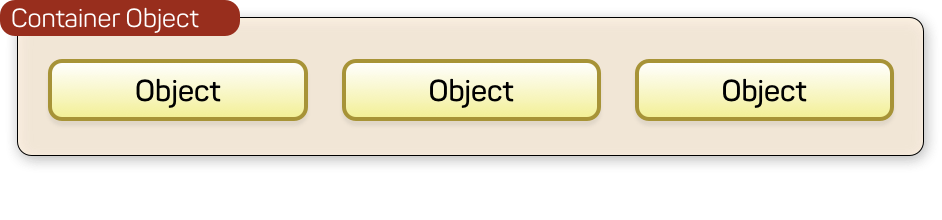
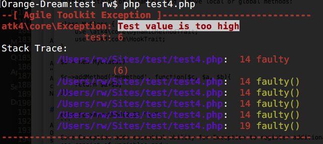
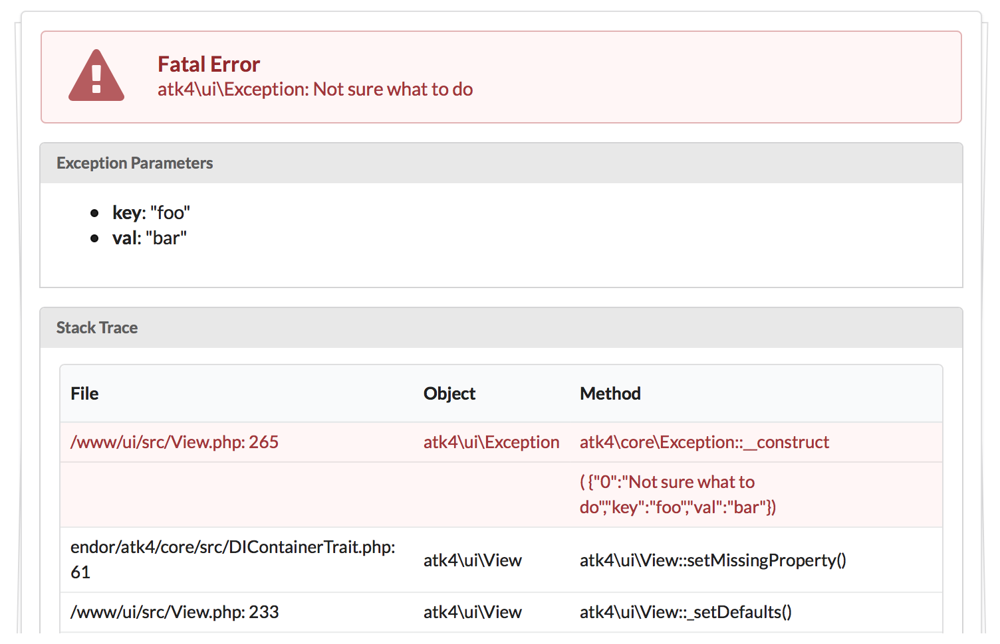

========================
Agile Core Documentation
========================

Agile Core is a collection of PHP Traits for designing object-oriented
frameworks. The main purpose for this project is to work as a foundation for
[Agile UI](https://github.com/atk4/ui) and [Agile Data](https://github.com/atk4/data),
but you are welcome to use some or all traits elsewhere.

.. toctree::
   :hidden:

   self

Object Containers
=================

Within your application / framework you can quite often have requirement for
using containers:

 - Form containing fields
 - Table containing columns
 - Component containing sub-components
 - Model object containing Field objects
 - Application containing controllers

Unlike PHP Array, containers offer number of advantages when one object need to
contain other object(s):

 - Execute some method when you add new element into container.
 - Automatically assign unique names to elements.
 - Associate element property with container :php:meth:`TrackableTrait::owner`.
 - Allowing adding by omitting class name.

To assign container properties to any object in your framework, use
:php:trait:`ContainerTrait`::

    $child = $container->add(new ChildClass());

    // $child is the object of ChildClass

    $container->removeElement($child);

Although containers work with any objects, assigning additional traits to your
ChildClass can extend the basic functionality.

 - :php:trait:`InitializerTrait` will add automatic code execution when adding
 - :php:trait:`AppScopeTrait` will pass value of $app property from container to
   child.
 - :php:trait:`TrackableTrait` will let you assign unique names to object
 - :php:trait:`FactoryTrait` will let you specify object class by Seed
 - :php:trait:`DIContainerTrait` will let you with dependency injection

Just to clarify what Seed is::

    $field = $form->add('TextArea');

In this scenario, even though a new object is added, we don't do it ourselves.
We simply specify some information on how to create and what properties to
inject into the object::

    $field = $form->add(['Password', 'icon'=>['lock', 'circular inverted'], 'width'=>4);

The above code will determine the correct object to implement Password inside
Form, instantiate it and then even add Icon object which is also defined through
seed.

.. toctree::
    :maxdepth: 3

    container
    initializer
    factory
    appscope
    di

Hooks
=====

When you look to make your framework / application extendable, the Hooks is a
modern standard in PHP applications. This way a 3rd-party addon can execute code
every time components are rendered or data is saved into database.

Our implementation of Hooks is based around storing callback references in array
for your standard objects then executing them.

Yet HookTrait implements many much needed extensions to make hooks work great:

 - define multiple hooking spot per object, e.g: 'beforeInit', 'beforeDelete' etc
 - multiple call-back can be assigned to each spot
 - callbacks are executed in order of numeric priority
 - arguments can be passed to callbacks
 - return values can be collected from callbacks
 - callback may "Break Hook" preventing other callbacks from being executed

Once you assign :php:trait:`HookTrait` to AnyClass, you can start assigning
and triggering callbacks::

    $object = new AnyClass();

    $object->addHook('test', function($o){ echo 'hello'; }
    $object->addHook('test', function($o){ echo 'world'; }

    $object->hook('test');
    // outputs: helloworld

.. toctree::
    :maxdepth: 3

    hook

Hook-based dynamic Methods
--------------------------

:php:trait:`DynamicMethodTrait` adds ability to add methods into objects
dynamically.
That's like a "trait" feature of a PHP, but implemented in run-time::

    $object->addMethod('test', function($o, $args){ echo 'hello, '.$args[0]; } );
    $object->test('world');
    // outputs: hello, world

There are also methods for removing and checking if methods exists, so::

    method_exists($object, 'test');
    // now should use
    $object->hasMethod('test');

    // and this way you can remove method
    $object->removeMethod('test');

The implementation of dynamic methods relies on Hook trait, so to use it::

    class AnyClass extends OtherClass {
        use HookTrait;
        use DynamicMethodTrait;

        // .. your code ..
    }

.. toctree::
    :maxdepth: 3

    dynamicmethod

Modelable Objects
=================

[Agile Data](https://github.com/atk4/data) features a modern implementation
for object modeling.
You may extend [Model](http://agile-data.readthedocs.io/en/develop/model.html)
class to define a business object, such as - ShoppingBag::

    class ShoppingBag extends \atk4\data\Model {
        public $table = 'shopping_bag';

        function init() {
            parent::init();

            $this->hasOne('user_id', new User());
            $this->hasMany('Items', new Item())
                ->addField('total_price', ['aggregate'=>'sum', 'field'=>'price']);
        }
    }

Such a model handles references to the user and items, is aware of storage
details, but it is a non-visual object. Because Model does not know if you will
need HTML or RestAPI to access it, it does not implement any visualization.

[Agile UI](https://github.com/atk4/ui) implements UI Components that can be
binded together with a model and will render HTML in a way that User can
understand and interact with.

To associate UI Component with Data Model a `setModel()` is used. But it's
not only the UI Components that can be associated with the model. In fact
"Authentication" controller can be associated with User model and RestAPI
endpoints can be associated with models. This is why `setModel()` is implemented
by a PHP Trait.

:php:trait:`ModelableTrait` allows you to associate your object with a Model::

    $form->setModel('Order');

    // or

    $grid->setModel($order->ref('Items'), ['name', 'qty', 'price']);

.. toctree::
    :maxdepth: 3

    modelable

Exceptions
==========

Exceptions in most programming languages are cryptic and confusing, about 5% of
the trace-back code is useful and it's obscured in most unique ways.

We've got an excellent solution by implementing exceptions our way. Simply
look at how beautiful and clean they look:

The same can be said about web output:

Agile Core implements :php:class:`Exception` class which offers many benefits
compared to standard PHP exceptions:

 - Pass additional information `new Exception(['Bad argument', 'arg'=>$arg'])`
 - Visualize in ASCII or HTML
 - Better means of localization

On top of that, there is :php:trait:`QuickExceptionTrait` which will add a
method for your class emitting new ready-to-throw exception::

    throw $object->exception(['Incorrect foo value', 'foo'=>$bar]);

This takes care of choosing the right class for exception, adding useful
context information and more.

.. toctree::
    :maxdepth: 3

    exception
    quickexception

Others
======

.. toctree::
    :maxdepth: 3

    debug
    session
