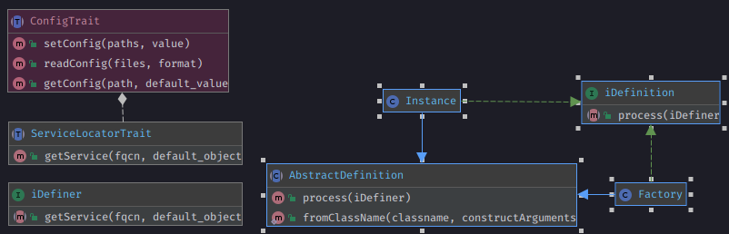

=====================
Definition Trait
=====================

.. php:trait:: DefinitionTrait

Agile Core extend support of ConfigTrait implementing Service Locator Design Pattern.

Introduction
============

It extends the functionality of ConfigTrait, with one method :

.. php:method: getService(string $fqcn, $default_value = null)

The role of this

This trait can help you with this features :

 - Respect Single Responsibility Principle, it will return the requested object.
 - - Requested object will be initialized outside your application, leaving this much smaller
 - If used correctly, testing of complex object will be much easier
 - Indirectly :
 - As a consequence, you will get rid of all the *new* keyword in your code
 - If used correctly, remove hard coupling generated by configuring dependencies of dependency, which violates Demeter's Law
 - If used correctly, it will hide dependency of dependency, which is good
 - To get an object and use it, you need only one line of code ( ex. `$this->getService('InterfaceOrClassOfTheService');` )
 - If you need a new object on every call, you must use Definition\Factory
 - If you need a single instance on every call, you must use Definition\Instance (it will be isolated in iDefiner object which use ConfigTrait)

`$fqcn` must be a valid Class or Interface name

ATTENTION : We need to execute PHP code in configuration file,
due to that you can't use JSON and YAML format for configuration file.

Methods
=======

.. php:method:: getService(string $path, $default_object = null)

    Get Service as Instance or Factory from $config.

    `$fqcn` must be a valid Class or Interface name
    `$default_object` must be null or an instance of $fqcn

Diagram ServiceLocatorTrait
======================================

ServiceLocatorTrait::
ServiceLocatorTrait
---------------

Can be used by any object that also use AppScope and is added to another object
that use ContainerTrait which implements iDefiner, like a $this->app->add(ObjectWithDefinitionTrait),
this way it gets the reference to ->app and consequently to iDefiner.

How to use it
=============

Suppose you have to declare a logger, until now you have done this way : ::

    $logger = new Logger('app');
    /* at least 10 LOC to config the logger */

    new App(['logger' => $logger]);
    // OR
    new App(['logger' => $logger]);
    // OR
    class MyApp extends \atk4\ui\App {

        public function prepareLogger() {

            $logger = new Logger('app');
            /* at least 10 LOC to config the logger */

            $this->logger = $logger;
        }
    }

using DefinerTrait, you can now use it like this :

in file config.php ::

    return [
        'logger' => [
            'enabled' => true,
            'path' => 'var/logs/',
            'file' => 'app.log',
            'level' => \Psr\Log\LogLevel::DEBUG,
            'rotate' => 7
        ],
        \Psr\Log\LoggerInterface::class => new Instance(function (iDefiner $c) {

            if(!$c->getConfig('logger/enabled')) {
                return NullLogger();
            }

            $logger = new Monolog\Logger();

            $path = $c->getConfig('logger/path');
            $file = $c->getConfig('logger/file');
            $level = $c->getConfig('logger/level');
            $rotate = $c->getConfig('logger/rotate');

            $handler = new RotatingFileHandler($path . DIRECTORY_SEPARATOR . $file, $rotate, $level);

            $logger->pushHandler($handler);

            return $logger;
        }),
    ];

in file MyApp.php ::

    class MyApp implements iDefiner {

        use DefinerTrait;

        public function __construct()
        {
            $this->logger = $this->getService(\Psr\Log\LoggerInterface::class);
        }
    }

    //OR better because it will be instantiated lazy for you

    class MyApp implements iDefiner {

        use DefinerTrait;

        public function log($message, $level)
        {
            $logger = $this->getService(\Psr\Log\LoggerInterface::class);
            // the first time it will be called
            // Definer will found the Instance object
            // Instance object will be processed and add to Config
            // next calls will refer to the instance already created like a ConfigTrait addition
            $logger->log($message, $level);
        }
    }

No further changes where needed, but all new keyword and whole definition of object is outside of your logic,
and with only one line you can get the object and use it

Definition\Factory & Definition\Instance
----------------------------------------
Both are used as a Callback Class which define a callable in the single constructor argument.
Instance and Factory have an extra static method as a shortcut for constructor that don't need further configuration ::

    public static function fromClassName(string $classname, ...$constructArguments) :Instance

Example : ::

    $config['MyClass'] = new Instance(function(iDefiner $c) {
        return new MyClass($myArg0, $myArg1, $myArg2)
    });

    $config['MyClass'] = new Factory(function(iDefiner $c) {
        return new MyClass($myArg0, $myArg1, $myArg2)
    });

the above code is the same as : ::

    $config['MyClass'] = Instance::fromClassName('MyClass',$myArg0, $myArg1, $myArg2);

    $config['MyClass'] = Factory::fromClassName('MyClass',$myArg0, $myArg1, $myArg2);

Conclusion on usage
-------------------

Practically many methods dedicated to setup resources can be removed from application logic.

Probably as a side effect, this lazy load of objects make loading of your Application much faster.

If the service object is used correctly, and anyt custom calls are inside the definition of the Service,
in the future you can switch implementation rather than creating a bridge middleware class to interact correctly with your application.